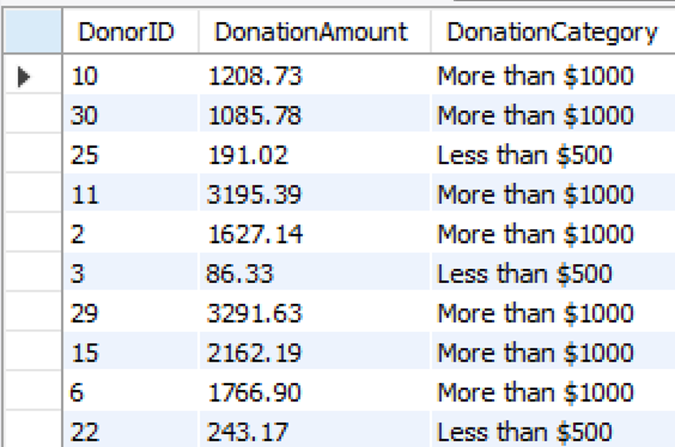
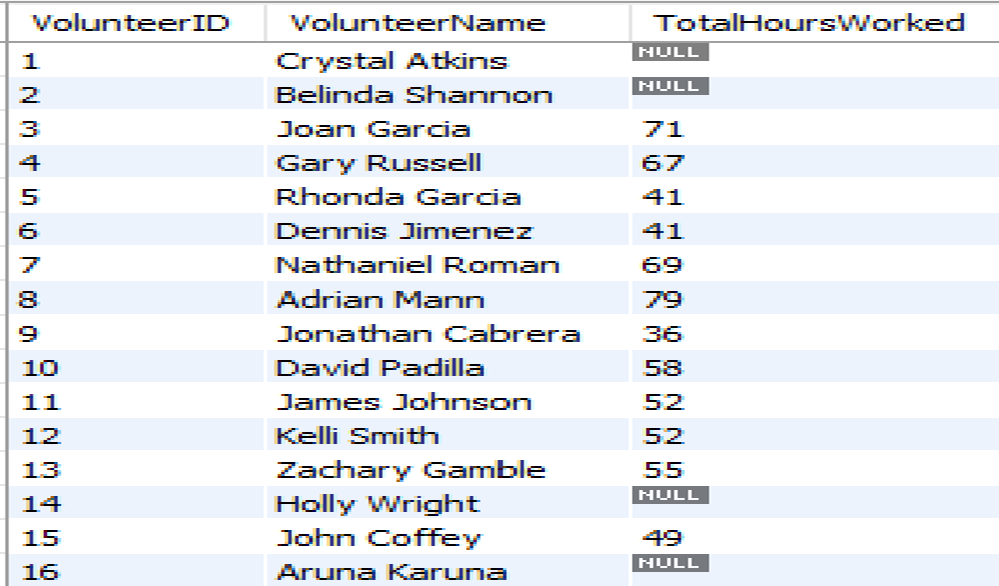

# SQL Project - NGO Operations

## 1. Project Overview

This project aims to design and implement a comprehensive database system and optimizing the operations of a non-governmental organization (NGO) using SQL. The dataset includes information about staff, volunteers, donars, donations, beneficiaries, projects, activities, expenses and feedback. The goal is to extract insights to support data-driven decision-making.

---

## 2. Objectives

- Analyze volunteer participation across various programs.
- Track details of donars, donations, amount and date.
- Identify high-impact programs and beneficiary reach.
- Optimize operational efficiency through data queries.

---

## 3. Dataset Description
### 3.1 Strong / Primary Tables

The project uses a relational database consisting of the following basic tables:

1. `Staff` - Represents the permanent employees of the NGO who play various roles in managing operations and implementing projects
2. `Staff Role` - Defines various roles that staff members can have within the NGO, such as NGO Head, Fundraising Manager, or Operations Manager.
3. `Volunteers` - Represents individuals who contribute their time and skills to the NGO's projects and activities on a voluntary basis.
4. `Projects` - Represents the various initiatives undertaken by the NGO to achieve its mission.
5. `ProjectActivities` - Represents specific activities that fall under a project. Each project can have multiple activities.
6. `Donars` - Represents individuals or organizations providing financial contributions to the NGO.
7. `Beneficiaries` - Represents the individuals or groups who benefit from the NGO’s projects.
8. `Expenses` - Tracks the financial expenditure associated with each project.

---

### 3.2 Week / Secondary Tables

Below are the additional tables required to maintain the relationships and among the given tables:

9. `VolunteerHours` - Tracks the hours contributed by volunteers to specific project activities.
10. `Beneficiaries_Feedback` - Captures feedback provided by beneficiaries on the projects they were part of.
11. `Donations` - Tracks financial contributions made by donors to specific projects.

These tables are connected via foreign keys to maintain data integrity.

---

### 3.3 Strong Relationsships

1.	Staff manages Projects (Staff to Projects, 1:N)
2.	Projects include ProjectActivities (Projects to ProjectActivities, 1:N)
3.	Donors contribute to Projects through Donations (Donors to Donations, N:M via Projects)
4.	Beneficiaries provide Feedback on Projects (Beneficiaries to Feedback, N:M via Projects)
5.	Volunteers contribute hours to ProjectActivities (Volunteers to VolunteerHours, N:M via ProjectActivities)

---

### 3.4 Weak Relationships

1.	VolunteerHours is associated with Volunteer and Activities (N:M:M relationship with Volunteers and Activities)
2.	Donations depend on Donors and Projects
3.	Beneficiaries_Feedback depends on Beneficiaries and Projects

---

## 4. Tools & Technologies

- **MySQL Workbench** - Used as the primary database design and management tool (DBMS). It facilitated the creation of the Entity-Relationship (ER) diagram, schema design, and SQL queries for managing data operations. 
- **SQL (Structured Query Language)** - SQL was used for defining, manipulating, and querying data within the MySQL database. Queries were written for tasks such as creating tables, managing relationships, and retrieving specific information.
- **MySQL Server** - To host the database and allow access for authorized users. The server ensures data integrity and provides support for multiple concurrent users
- **Draw.io** - This tool was used for ER Modeling

---

## 5. Data Model Diagram

---

## 6. Key SQL Queries

#### 6.1 1. Database and Tables Creation (DDL)

#### 6.1 2. Additional DDL Queries

#### 6.1 3. Database Manipulation Queries (DML)

#### 6.1 4. Data Retreival with Filters and Operations

#### 6.1 5. Aggregation Queries

#### 6.1 6. Window Functions and Subqueries

#### 6.1 7. Common Table Expression (CTEs)

#### 6.1 8. Queries_Views

#### 6.1 9. Queries_StoredProcedures

#### 6.1 10. NGO Operations Insights

---

## 7. Findings & Recommendations

- **Donor Engagement, Retention & Contribution Trends Over Time**: 
    - Who is donating, to which projects and when
    - A few major donors contribute the majority of funds. Implement loyalty and recognition programs.
- **Monthly Donation Trends**: 
    - Are donations seasonal?
    - Plan fundraising strategies to manage seasonal donation issues
- **Top Performing Projects**: 
    - Donations received + Volunteer hours + Feedback
    - Educate and try to pull more Donars and Donations for low performed projects 
- **Volunteer Workload Distribution and Optimization**: 
    - Where and how much volunteers are contributing.
    - Are some volunteers over/under-utilized?
    - Optimize the volunteer involvement on project activities as required
- **Beneficery Feedback**: 
    - Feedback on projects and activities
    - Encourage and Collect feedback from all beneficiries to evaluate the service activities
    - Evaluate recommendations and take decisions accordingly
    - Identify the projects and volunteers performance and take neccessary improvement steps 

---

## 8 Challenges Faced

- Inconsistent data entries and missing values
- Complex joins due to many-to-many relationships
- Normalization needed for program-beneficiary mapping

---

## 9. Conclusion

SQL can provide powerful insights into NGO operations by uncovering patterns in donations, volunteers, and project outcomes. These insights help NGOs maximize impact and improve transparency with stakeholders.

---

## 10. Screenshots
**Few Query Results / NGO Operations Insights:**

---

## 11. Author

**Details**  
- Email: sriramapemmasani@gmail.com 
- GitHub: [Sridevi-Pemmasani](https://github.com/Sridevi-Pemmasani)
