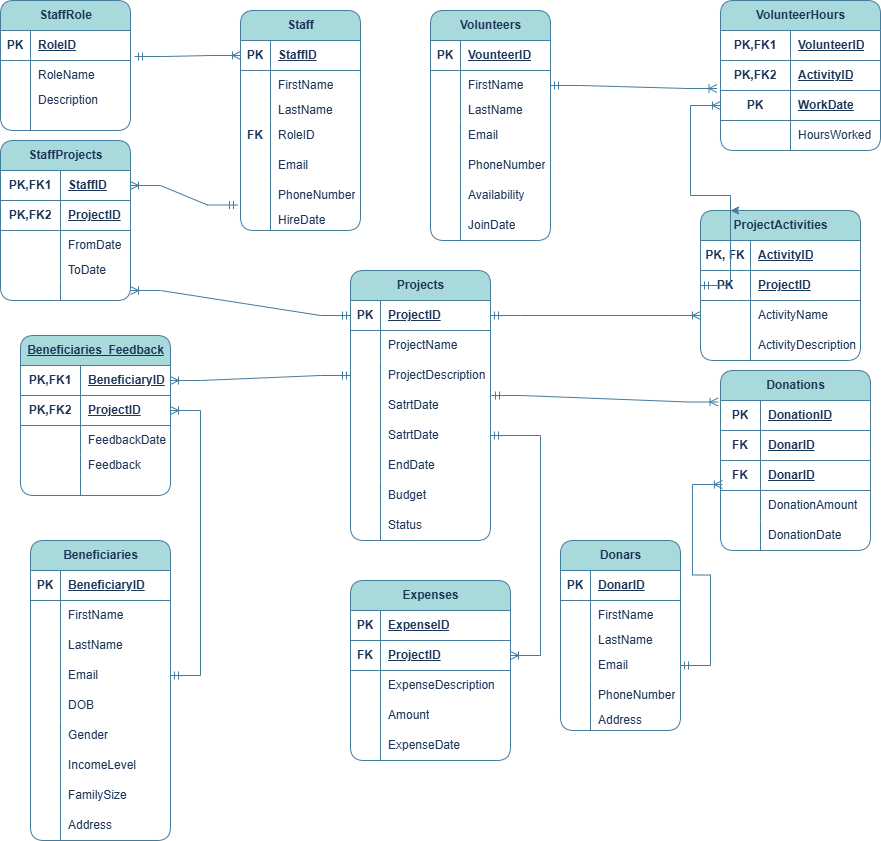

# SQL Project - NGO Operations

## 1. Project Overview

This project focuses on analyzing and optimizing the operations of a non-governmental organization (NGO) using SQL. The dataset includes information about volunteers, programs, donations, and beneficiaries. The goal is to extract insights to support data-driven decision-making.

---

## 2. Objectives

- Analyze volunteer participation across various programs.
- Track donations by amount, donor type, and geography.
- Identify high-impact programs and beneficiary reach.
- Optimize operational efficiency through data queries.

---

## 3. Dataset Description

The project uses a relational database consisting of the following tables:

- `Volunteers`
- `Programs`
- `Donations`
- `Beneficiaries`
- `Events`

These tables are connected via foreign keys to maintain data integrity.

---

## 4. Tools & Technologies

- **Microsoft Excel** for data capture and cleaning
- **MySQL** for data storing, querying and analysis
- **Draw.io** for creating Entity Relationship diagram
---

## 5. Data Model Diagram

> 


---

## 6. Key SQL Queries


### 6.1 1. Database and Tables Creation
 > 


### 6.1 Top Donors by Total Contribution
```sql
SELECT DonorName, SUM(Amount) AS TotalDonated
FROM Donations
GROUP BY DonorName
ORDER BY TotalDonated DESC
LIMIT 10;
```

### 6.2 Volunteer Participation by Program
```sql
SELECT ProgramName, COUNT(VolunteerID) AS TotalVolunteers
FROM Volunteers
JOIN Programs ON Volunteers.ProgramID = Programs.ProgramID
GROUP BY ProgramName;
```

### 6.3 Monthly Donation Trends
```sql
SELECT DATE_FORMAT(DonationDate, '%Y-%m') AS Month, SUM(Amount) AS Total
FROM Donations
GROUP BY Month
ORDER BY Month;
```

### 6.4 Beneficiaries by Region
```sql
SELECT Region, COUNT(BeneficiaryID) AS TotalBeneficiaries
FROM Beneficiaries
GROUP BY Region;
```

---

## 7. Findings & Recommendations

- **Donor Engagement**: A few major donors contribute the majority of funds. Implement loyalty and recognition programs.
- **Volunteer Optimization**: Certain programs are overstaffed. Balance volunteer distribution.
- **Donation Peaks**: High donations during festival seasons. Plan campaigns accordingly.
- **Regional Impact**: Some regions have fewer beneficiaries. Reallocate resources to underserved areas.

---

## 8. Challenges Faced

- Inconsistent data entries and missing values
- Complex joins due to many-to-many relationships
- Normalization needed for program-beneficiary mapping

---

## 9. Conclusion

SQL can provide powerful insights into NGO operations by uncovering patterns in donations, volunteers, and program outcomes. These insights help NGOs maximize impact and improve transparency with stakeholders.

---

## 10. Screenshots

>   
> 

*(Replace these with your actual image paths in the repo)*

---

## 11. Author

**Your Name**  
Email: your.email@example.com  
GitHub: [yourusername](https://github.com/yourusername)
