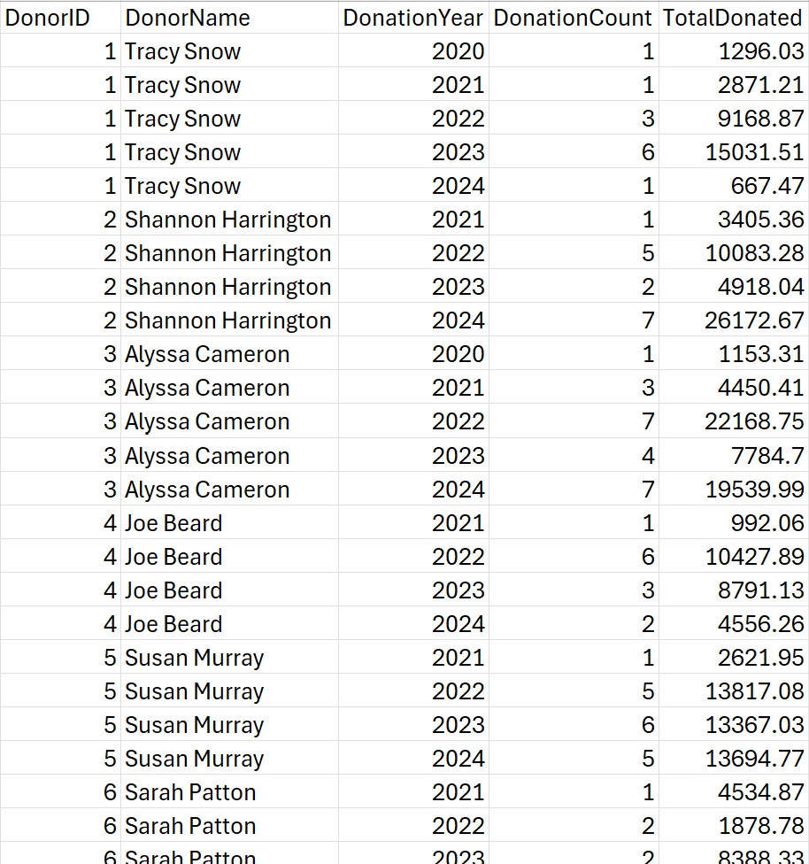

# SQL Project - NGO Operations

## 1. Project Overview

This project aims to design and implement a comprehensive database system and optimizing the operations of a non-governmental organization (NGO) using SQL. The dataset includes information about staff, volunteers, donars, donations, beneficiaries, projects, activities, expenses and feedback. The goal is to extract insights to support data-driven decision-making.

---

## 2. Objectives

- Create a new database from scratch to support operational insights for a Non-Governmental Organization (NGO).
- Design and implement a normalized database structure to ensure data consistency and integrity.
- Creat primary and dependent tables to maintain proper relationships and eliminate redundancy.
- Prepare and upload data into the database.
- Extract insights using complex SQL queries on volunteer engagement, donations, programs, and beneficiary impact.
- Provide insights and Recomendations

---

## 3. Dataset Description
### 3.1 Strong / Primary Tables

The project uses a relational database consisting of the following basic tables:

1. `Staff` - Represents the permanent employees of the NGO who play various roles in managing operations and implementing projects
2. `Staff Role` - Defines various roles that staff members can have within the NGO, such as NGO Head, Fundraising Manager, or Operations Manager.
3. `Volunteers` - Represents individuals who contribute their time and skills to the NGO's projects and activities on a voluntary basis.
4. `Projects` - Represents the various initiatives undertaken by the NGO to achieve its mission.
5. `ProjectActivities` - Represents specific activities that fall under a project. Each project can have multiple activities.
6. `Donars` - Represents individuals or organizations providing financial contributions to the NGO.
7. `Beneficiaries` - Represents the individuals or groups who benefit from the NGO’s projects.
8. `Expenses` - Tracks the financial expenditure associated with each project.

### 3.2 Week / Secondary Tables

Below are the additional tables required to maintain the relationships and among the given tables:

9. `VolunteerHours` - Tracks the hours contributed by volunteers to specific project activities.
10. `Beneficiaries_Feedback` - Captures feedback provided by beneficiaries on the projects they were part of.
11. `Donations` - Tracks financial contributions made by donors to specific projects.

These tables are connected via foreign keys to maintain data integrity.

### 3.3 Strong Relationsships

1.	Staff manages Projects (Staff to Projects, 1:N)
2.	Projects include ProjectActivities (Projects to ProjectActivities, 1:N)
3.	Donors contribute to Projects through Donations (Donors to Donations, N:M via Projects)
4.	Beneficiaries provide Feedback on Projects (Beneficiaries to Feedback, N:M via Projects)
5.	Volunteers contribute hours to ProjectActivities (Volunteers to VolunteerHours, N:M via ProjectActivities)

### 3.4 Weak Relationships

1.	VolunteerHours is associated with Volunteer and Activities (N:M:M relationship with Volunteers and Activities)
2.	Donations depend on Donors and Projects
3.	Beneficiaries_Feedback depends on Beneficiaries and Projects

---

## 4. Tools & Technologies

- **MySQL Server** - The engine that runs and manages the database operations.
- **MySQL** - An open-source RDBMS used for storing and managing relational data.
- **MySQL Workbench** - A visual tool for database design and management. Used for ER diagrams, schema creation, and running SQL queries. 
- **SQL (Structured Query Language)** - The language used to define, manipulate, and query data in the MySQL database.
- **Draw.io** - Used for ER modeling and visualizing database structure before implementation

---

## 5. Data Model Diagram

---

## 6. Key SQL Queries

#### 6.1 1. Database and Tables Creation (DDL)

#### 6.1 2. Additional DDL Queries

#### 6.1 3. Database Manipulation Queries (DML)

#### 6.1 4. Data Retreival with Filters and Operations

#### 6.1 5. Aggregation Queries

#### 6.1 6. Window Functions and Subqueries

#### 6.1 7. Common Table Expression (CTEs)

#### 6.1 8. Queries_Views

#### 6.1 9. Queries_StoredProcedures

#### 6.1 10. NGO Operations Insights

---

## 7. Findings & Recommendations

### 💡 **Key Insights:**

✅ **Donor Contribution Concentration:** A small group of major donors is responsible for a significant portion of the total funds raised.

✅ **Seasonal & Event-Based Donation Trends:** Donation volumes fluctuate depending on the season and specific events or campaigns.

✅ **Volunteer Resource Imbalance:** Volunteer engagement is not consistently aligned with project needs—some projects face overstaffing while others are understaffed.

✅ **Underperforming Projects Identified:** A few projects are consistently showing low performance or impact, requiring strategic attention.

---

### 🚀 **Recommended Actions:**

🌟 **Enhance Donor Engagement:** Introduce loyalty and recognition programs (e.g., donor spotlights, milestone awards) to attract and retain high-value donors, especially for underfunded projects.

📅 **Strategic Fundraising Planning:** Develop seasonal fundraising calendars and event-based campaigns to better manage fluctuations and ensure consistent funding throughout the year.

🧩 **Optimize Volunteer Allocation:** Implement a volunteer management system that matches volunteer skills and availability with specific project demands to improve efficiency and satisfaction.

💬 **Collect & Act on Beneficiary Feedback:** Regularly gather structured feedback from beneficiaries to assess service quality, identify improvement areas, and increase impact.

---

## 8 Challenges Faced

- Inconsistent data entries and missing values
- Complex joins due to many-to-many relationships
- Normalization needed for program-beneficiary mapping

---

## 9. Conclusion

SQL can provide powerful insights into NGO operations by uncovering patterns in donations, volunteers, and project outcomes. These insights help NGOs maximize impact and improve transparency with stakeholders.

---

## 10. Screenshots
**Few Query Results / NGO Operations Insights:**

**1. Donar Contributions against Different Projects**

**2. Average Donations for Project**

**3. Monthly Donation Trend**

**4. Top 3 Donars by Project**

**5. Top Performing Projects by Impact**

**6. Donor Retention & Contribution Trends Over Time**

**7. Volunteer Work Distribution**

**8. Rolling Totals of Volunteer Work Hours**

**9. Beneficiries Feedback by Project**

---

## **📬 Connect With Me**  

💼 **LinkedIn:** (www.linkedin.com/in/sridevi-pemmasani-2b849a317)

📧 **Email:** sriramapemmasani@gmail.com 

🚀 **GitHub:** (https://github.com/Sridevi-Pemmasani) 

